# TelemetryGuard — Implementation Plan

**Generated:** 2026-08-12 · **Source of truth for scope:** [`spec.md`](spec.md) (decisions D1–D23) · **Task detail:** [`tasks/`](tasks/)

54 tasks across 5 phases. Every task file in `doc/tasks/` is written to be **self-contained**: a smaller model (Haiku/Sonnet-class) can implement it with only that file plus the repository checkout — exact paths, full signatures, SQL/DDL, package names, numbered steps, and mechanically checkable acceptance criteria are embedded. Implementers do not need to read `spec.md`.

## How to execute a task

1. Pick a task whose `depends_on` are all complete (see dependency graph below). Tasks with no unmet deps can run in parallel.
2. Read **only** that task file, plus the task files of its `depends_on` where the file tells you to consume a contract.
3. Honor the **Out of scope / guardrails** section — it restates the hard constraints (Dapper not EF, RLS as primary tenancy enforcement, NaN-not-zero semantics, rules only raise scores, <50 ms scoring budget, no server-side Python/Node, no generic cross-engine query layer).
4. The acceptance criteria are the definition of done; the Testing section is part of the task, not optional.
5. Contract-bearing tasks (FND-04, ANA-01, RSK-01) are **normative** — downstream tasks reference their exact type names.

## Phase overview

| Phase | Goal | Tasks |
|---|---|---|
| **Phase 0** (0) | Repo compiles, dev stack runs, CI green | FND-01, FND-02, FND-03, FND-04 |
| **Phase 1** (1) | Full MVP: capture → enrich → score (rules + heuristic) → decide → store; Turnstile; Grafana; Docker Compose deploy | ANA-01, ANA-02, ANA-03, ANA-04, ANA-05, ANA-06, ANA-07, API-01, API-02, API-03, API-04, API-05, API-06, API-07, DAT-01, DAT-02, DAT-03, DAT-04, DAT-05, DAT-06, DAT-07, DAT-08, DAT-09, INT-01, OPS-01, RSK-01, RSK-02, RSK-03, RSK-04, RSK-05, RSK-06, RSK-07, SDK-01, SDK-02, SDK-03, SDK-04, SDK-05, SDK-06, SDK-07, SDK-08 |
| **Phase 1.5** (1.5) | Cloudflare TLS signals, ad-platform exclusion sync with approval mode, first LightGBM model via listen-only pilot | INT-02, INT-03, INT-04, INT-05, RSK-08 |
| **Phase 2** (2) | Publisher aggregates, retraining loop, customer portal, Azure Container Apps | P2-01, P2-02, P2-03, P2-04 |
| **Later** (later) | Kusto provider + contract-test matrix | P2-05 |

## Critical path and parallel tracks

The longest serial chain (critical path) is:

`FND-01 → DAT-01 → DAT-02 → DAT-03 → DAT-04 → API-01 → API-02/API-04 → API-06` (verdict finalization is where everything converges).

After `FND-01`, four tracks proceed **in parallel**:

- **Data track:** DAT-01 → … → DAT-08, then DAT-09 provisioning (unblocks end-to-end runs)
- **Analytics track:** ANA-01/ANA-02 → sink + queries → contract tests → rollups
- **Risk track:** RSK-01 contracts first (unblocks many), then enrichment/velocity/extraction/rules/scorer → RSK-07 pipeline
- **SDK track:** fully independent of .NET until SDK-04/05 consume the API-04 wire contract (mocked in SDK-06 tests, so no build-order block); SDK-08 serves the bundle from the API host

## Phase 0 — Foundation

| ID | Title | Size | Depends on | File |
|---|---|---|---|---|
| FND-01 | Solution and project scaffold | M | — | [`FND-01-solution-and-project-scaffold.md`](tasks/FND-01-solution-and-project-scaffold.md) |
| FND-02 | Docker Compose dev stack | M | — | [`FND-02-docker-compose-dev-stack.md`](tasks/FND-02-docker-compose-dev-stack.md) |
| FND-03 | CI pipeline (GitHub Actions) | M | FND-01 | [`FND-03-ci-pipeline-github-actions.md`](tasks/FND-03-ci-pipeline-github-actions.md) |
| FND-04 | Core primitives (ITenantContext, TenantId, IClock) | S | FND-01 | [`FND-04-core-primitives.md`](tasks/FND-04-core-primitives.md) |

## Phase 1 — MVP

| ID | Title | Size | Depends on | File |
|---|---|---|---|---|
| ANA-01 | Analytics abstractions (IEventSink, IAnalyticsQueries, ClickEvent) | L | FND-01, FND-04 | [`ANA-01-analytics-abstractions.md`](tasks/ANA-01-analytics-abstractions.md) |
| ANA-02 | ClickHouse schema with per-row TTL | M | FND-02 | [`ANA-02-clickhouse-schema-per-row-ttl.md`](tasks/ANA-02-clickhouse-schema-per-row-ttl.md) |
| ANA-03 | ClickHouse event sink (batched, non-blocking) | L | ANA-01, ANA-02 | [`ANA-03-clickhouse-event-sink.md`](tasks/ANA-03-clickhouse-event-sink.md) |
| ANA-04 | ClickHouse analytics queries | M | ANA-01, ANA-02 | [`ANA-04-clickhouse-analytics-queries.md`](tasks/ANA-04-clickhouse-analytics-queries.md) |
| ANA-05 | Analytics provider DI switch | S | ANA-03, ANA-04 | [`ANA-05-analytics-provider-di-switch.md`](tasks/ANA-05-analytics-provider-di-switch.md) |
| ANA-06 | Analytics contract test suite | M | ANA-03, ANA-04 | [`ANA-06-analytics-contract-test-suite.md`](tasks/ANA-06-analytics-contract-test-suite.md) |
| ANA-07 | Rollup job ClickHouse to SQL summaries | M | ANA-04, DAT-06 | [`ANA-07-rollup-clickhouse-to-sql.md`](tasks/ANA-07-rollup-clickhouse-to-sql.md) |
| API-01 | API skeleton, middleware order, OpenTelemetry | M | FND-01, FND-04, DAT-04 | [`API-01-api-skeleton-middleware-otel.md`](tasks/API-01-api-skeleton-middleware-otel.md) |
| API-02 | Click tracker endpoint /c | L | API-01, RSK-03, ANA-03, DAT-05 | [`API-02-click-tracker-endpoint.md`](tasks/API-02-click-tracker-endpoint.md) |
| API-03 | Pixel endpoint /p.gif | S | API-01, ANA-03, DAT-05 | [`API-03-pixel-endpoint.md`](tasks/API-03-pixel-endpoint.md) |
| API-04 | Beacon ingestion /i and /i/init | L | API-01, ANA-03, RSK-03, DAT-05 | [`API-04-beacon-ingestion.md`](tasks/API-04-beacon-ingestion.md) |
| API-05 | Decision endpoint /decide | M | API-01, RSK-07, INT-01 | [`API-05-decision-endpoint.md`](tasks/API-05-decision-endpoint.md) |
| API-06 | Verdict finalization and grace-period worker | L | API-02, API-04, RSK-07, DAT-06 | [`API-06-verdict-finalization.md`](tasks/API-06-verdict-finalization.md) |
| API-07 | Admin and whitelist API | M | API-01, DAT-07, DAT-05, DAT-06, ANA-01 | [`API-07-admin-whitelist-api.md`](tasks/API-07-admin-whitelist-api.md) |
| DAT-01 | DbUp migration runner | S | FND-01 | [`DAT-01-dbup-migration-runner.md`](tasks/DAT-01-dbup-migration-runner.md) |
| DAT-02 | Core relational schema migration | M | DAT-01 | [`DAT-02-core-relational-schema.md`](tasks/DAT-02-core-relational-schema.md) |
| DAT-03 | Row-Level Security and tenant-bound connections | L | DAT-02, FND-04 | [`DAT-03-rls-and-tenant-connections.md`](tasks/DAT-03-rls-and-tenant-connections.md) |
| DAT-04 | Tenant resolution middleware | M | DAT-03 | [`DAT-04-tenant-resolution-middleware.md`](tasks/DAT-04-tenant-resolution-middleware.md) |
| DAT-05 | Config repositories (Dapper) | M | DAT-03 | [`DAT-05-config-repositories-dapper.md`](tasks/DAT-05-config-repositories-dapper.md) |
| DAT-06 | Verdict summary, exclusion queue and watermark tables | M | DAT-03 | [`DAT-06-verdict-exclusion-watermark-tables.md`](tasks/DAT-06-verdict-exclusion-watermark-tables.md) |
| DAT-07 | Whitelist tables and repository | M | DAT-03, ANA-01 | [`DAT-07-whitelist-tables-and-repository.md`](tasks/DAT-07-whitelist-tables-and-repository.md) |
| DAT-08 | SQL integration test harness and RLS proof | M | DAT-05, DAT-06, DAT-07 | [`DAT-08-sql-integration-test-harness.md`](tasks/DAT-08-sql-integration-test-harness.md) |
| DAT-09 | Tenant provisioning and dev seed | M | DAT-03, DAT-05 | [`DAT-09-tenant-provisioning-and-dev-seed.md`](tasks/DAT-09-tenant-provisioning-and-dev-seed.md) |
| INT-01 | Turnstile verification service | S | FND-01 | [`INT-01-turnstile-verification-service.md`](tasks/INT-01-turnstile-verification-service.md) |
| OPS-01 | Grafana provisioning and starter dashboards | M | FND-02, ANA-02 | [`OPS-01-grafana-provisioning-and-dashboards.md`](tasks/OPS-01-grafana-provisioning-and-dashboards.md) |
| RSK-01 | "Risk contracts: FraudFeatureVector and IScorer" | L | FND-01 | [`RSK-01-risk-contracts-feature-vector-iscorer.md`](tasks/RSK-01-risk-contracts-feature-vector-iscorer.md) |
| RSK-02 | "IP enrichment (GeoIP, ASN, proxy, Tor, Private Relay)" — *amended by D24: provider model, iplegence default* | M | FND-01 | [`RSK-02-ip-enrichment.md`](tasks/RSK-02-ip-enrichment.md) |
| RSK-03 | "Redis velocity store and click-id dedupe" | M | FND-02, FND-04 | [`RSK-03-redis-velocity-store.md`](tasks/RSK-03-redis-velocity-store.md) |
| RSK-04 | "Feature extraction" | L | RSK-01, RSK-02, RSK-03 | [`RSK-04-feature-extraction.md`](tasks/RSK-04-feature-extraction.md) |
| RSK-05 | "T1 rule engine" | M | RSK-01 | [`RSK-05-t1-rule-engine.md`](tasks/RSK-05-t1-rule-engine.md) |
| RSK-06 | "Heuristic scorer (MVP)" | M | RSK-01 | [`RSK-06-heuristic-scorer.md`](tasks/RSK-06-heuristic-scorer.md) |
| RSK-07 | "Scoring pipeline within the 50ms budget" | M | RSK-04, RSK-05, RSK-06, DAT-07 | [`RSK-07-scoring-pipeline.md`](tasks/RSK-07-scoring-pipeline.md) |
| SDK-01 | SDK project, esbuild bundle, size gate | M | — | [`SDK-01-sdk-project-esbuild-bundle-size-gate.md`](tasks/SDK-01-sdk-project-esbuild-bundle-size-gate.md) |
| SDK-02 | Core runtime, session, transport | M | SDK-01 | [`SDK-02-core-runtime-session-transport.md`](tasks/SDK-02-core-runtime-session-transport.md) |
| SDK-03 | Behavioral collectors (timing only) | L | SDK-02 | [`SDK-03-behavioral-collectors-timing-only.md`](tasks/SDK-03-behavioral-collectors-timing-only.md) |
| SDK-04 | Fingerprint, Botd, storage age | M | SDK-02 | [`SDK-04-fingerprint-botd-storage-age.md`](tasks/SDK-04-fingerprint-botd-storage-age.md) |
| SDK-05 | Beacon integrity module | S | SDK-02 | [`SDK-05-beacon-integrity-module.md`](tasks/SDK-05-beacon-integrity-module.md) |
| SDK-06 | Playwright fixtures, tests, bot generator | M | SDK-03, SDK-04 | [`SDK-06-playwright-fixtures-tests-bot-generator.md`](tasks/SDK-06-playwright-fixtures-tests-bot-generator.md) |
| SDK-07 | Client decision flow (form gating, Turnstile round-trip) | M | SDK-03, SDK-06 | [`SDK-07-client-decision-flow-form-gating.md`](tasks/SDK-07-client-decision-flow-form-gating.md) |
| SDK-08 | SDK bundle delivery (/sdk/tg.js route and snippet URL contract) | S | SDK-01, API-01 | [`SDK-08-sdk-bundle-delivery.md`](tasks/SDK-08-sdk-bundle-delivery.md) |

## Phase 1.5 — Enforcement & first model

| ID | Title | Size | Depends on | File |
|---|---|---|---|---|
| INT-02 | EnforcementMode approval queue flow | M | DAT-06, API-06 | [`INT-02-enforcement-mode-approval-queue.md`](tasks/INT-02-enforcement-mode-approval-queue.md) |
| INT-03 | Google Ads exclusion sync | L | INT-02, DAT-06 | [`INT-03-google-ads-exclusion-sync.md`](tasks/INT-03-google-ads-exclusion-sync.md) |
| INT-04 | Meta Marketing API wrapper | M | INT-02 | [`INT-04-meta-marketing-api-wrapper.md`](tasks/INT-04-meta-marketing-api-wrapper.md) |
| INT-05 | Cloudflare fronting and TLS fingerprint intake | M | API-02, RSK-04, API-03, API-04 | [`INT-05-cloudflare-fronting-tls-intake.md`](tasks/INT-05-cloudflare-fronting-tls-intake.md) |
| RSK-08 | "Label pipeline, LightGBM training, listen-only rollout" | L | RSK-07, API-06, SDK-06, ANA-02, DAT-07 | [`RSK-08-lightgbm-training-listen-only.md`](tasks/RSK-08-lightgbm-training-listen-only.md) |

## Phase 2 — Portal, aggregates, Azure

| ID | Title | Size | Depends on | File |
|---|---|---|---|---|
| P2-01 | Publisher aggregates (outline) *(outline)* | M | ANA-07 | [`P2-01-publisher-aggregates.md`](tasks/P2-01-publisher-aggregates.md) |
| P2-02 | Retraining loop (outline) *(outline)* | M | RSK-08 | [`P2-02-retraining-loop.md`](tasks/P2-02-retraining-loop.md) |
| P2-03 | Customer portal with review/override screen (outline) *(outline)* | L | API-07, INT-02 | [`P2-03-customer-portal-review-override.md`](tasks/P2-03-customer-portal-review-override.md) |
| P2-04 | Azure deployment (outline) *(outline)* | M | FND-03 | [`P2-04-azure-deployment.md`](tasks/P2-04-azure-deployment.md) |

## Later — on demand

| ID | Title | Size | Depends on | File |
|---|---|---|---|---|
| P2-05 | Kusto analytics provider (outline) *(outline)* | L | ANA-06 | [`P2-05-kusto-analytics-provider.md`](tasks/P2-05-kusto-analytics-provider.md) |

## Dependency graph

```mermaid
graph TD
  subgraph P0[Phase 0 — Foundation]
    FND01[FND-01]
    FND02[FND-02]
    FND03[FND-03]
    FND04[FND-04]
  end
  subgraph P1[Phase 1 — MVP]
    ANA01[ANA-01]
    ANA02[ANA-02]
    ANA03[ANA-03]
    ANA04[ANA-04]
    ANA05[ANA-05]
    ANA06[ANA-06]
    ANA07[ANA-07]
    API01[API-01]
    API02[API-02]
    API03[API-03]
    API04[API-04]
    API05[API-05]
    API06[API-06]
    API07[API-07]
    DAT01[DAT-01]
    DAT02[DAT-02]
    DAT03[DAT-03]
    DAT04[DAT-04]
    DAT05[DAT-05]
    DAT06[DAT-06]
    DAT07[DAT-07]
    DAT08[DAT-08]
    DAT09[DAT-09]
    INT01[INT-01]
    OPS01[OPS-01]
    RSK01[RSK-01]
    RSK02[RSK-02]
    RSK03[RSK-03]
    RSK04[RSK-04]
    RSK05[RSK-05]
    RSK06[RSK-06]
    RSK07[RSK-07]
    SDK01[SDK-01]
    SDK02[SDK-02]
    SDK03[SDK-03]
    SDK04[SDK-04]
    SDK05[SDK-05]
    SDK06[SDK-06]
    SDK07[SDK-07]
    SDK08[SDK-08]
  end
  subgraph P15[Phase 1.5]
    INT02[INT-02]
    INT03[INT-03]
    INT04[INT-04]
    INT05[INT-05]
    RSK08[RSK-08]
  end
  subgraph P2[Phase 2]
    P201[P2-01]
    P202[P2-02]
    P203[P2-03]
    P204[P2-04]
  end
  subgraph PL[Later]
    P205[P2-05]
  end
  FND01 --> FND03
  FND01 --> FND04
  FND01 --> ANA01
  FND04 --> ANA01
  FND02 --> ANA02
  ANA01 --> ANA03
  ANA02 --> ANA03
  ANA01 --> ANA04
  ANA02 --> ANA04
  ANA03 --> ANA05
  ANA04 --> ANA05
  ANA03 --> ANA06
  ANA04 --> ANA06
  ANA04 --> ANA07
  DAT06 --> ANA07
  FND01 --> API01
  FND04 --> API01
  DAT04 --> API01
  API01 --> API02
  RSK03 --> API02
  ANA03 --> API02
  DAT05 --> API02
  API01 --> API03
  ANA03 --> API03
  DAT05 --> API03
  API01 --> API04
  ANA03 --> API04
  RSK03 --> API04
  DAT05 --> API04
  API01 --> API05
  RSK07 --> API05
  INT01 --> API05
  API02 --> API06
  API04 --> API06
  RSK07 --> API06
  DAT06 --> API06
  API01 --> API07
  DAT07 --> API07
  DAT05 --> API07
  DAT06 --> API07
  ANA01 --> API07
  FND01 --> DAT01
  DAT01 --> DAT02
  DAT02 --> DAT03
  FND04 --> DAT03
  DAT03 --> DAT04
  DAT03 --> DAT05
  DAT03 --> DAT06
  DAT03 --> DAT07
  ANA01 --> DAT07
  DAT05 --> DAT08
  DAT06 --> DAT08
  DAT07 --> DAT08
  DAT03 --> DAT09
  DAT05 --> DAT09
  FND01 --> INT01
  FND02 --> OPS01
  ANA02 --> OPS01
  FND01 --> RSK01
  FND01 --> RSK02
  FND02 --> RSK03
  FND04 --> RSK03
  RSK01 --> RSK04
  RSK02 --> RSK04
  RSK03 --> RSK04
  RSK01 --> RSK05
  RSK01 --> RSK06
  RSK04 --> RSK07
  RSK05 --> RSK07
  RSK06 --> RSK07
  DAT07 --> RSK07
  SDK01 --> SDK02
  SDK02 --> SDK03
  SDK02 --> SDK04
  SDK02 --> SDK05
  SDK03 --> SDK06
  SDK04 --> SDK06
  SDK03 --> SDK07
  SDK06 --> SDK07
  SDK01 --> SDK08
  API01 --> SDK08
  DAT06 --> INT02
  API06 --> INT02
  INT02 --> INT03
  DAT06 --> INT03
  INT02 --> INT04
  API02 --> INT05
  RSK04 --> INT05
  API03 --> INT05
  API04 --> INT05
  RSK07 --> RSK08
  API06 --> RSK08
  SDK06 --> RSK08
  ANA02 --> RSK08
  DAT07 --> RSK08
  ANA07 --> P201
  RSK08 --> P202
  API07 --> P203
  INT02 --> P203
  FND03 --> P204
  ANA06 --> P205
```

## Backlog (proposed, not yet tasked)

Surfaced during plan verification; create numbered task files when their phase approaches:

- **1.5** — Label/feature export query for training (tg_labels ⋈ tg_events); site-level (non-campaign) rollup summaries; rules/weights tuning playbook for the listen-only window; add `cf_bot_score` to ClickEvent + schema (feature-set v2); tenant integration docs (JS vs pixel embed).
- **1.5 (contract gap, found 2026-08-16)** — there is no test that exercises the **real** SDK bundle against the **real** API. The SDK e2e suite runs against a mock `/i`, and `BeaconEndpointTests` hand-builds its requests, so the two sides disagreed for the entire MVP without failing anything: the shipped SDK posts `POST /i` with the site key inside the envelope (SDK-02, canonical), while the API required it as a `?k=` query param and silently 204'd every real beacon. Fixed in `BeaconEndpoints` (query first, then envelope `k`), but the class of bug needs a browser-drives-real-API smoke test in CI to stay fixed.
- **1.5 / 2 (D24 follow-up)** — validate iplegence's *inferred* `traits.usage_type` against live data (it now supplies `AsnType`, including `Mobile`, for ~45% of routable IPv4 space); the composite provider layering IP2Proxy `usage_type` over iplegence remains the fallback only if that inference proves unreliable. Also: scheduled (cron/timer) invocation of `scripts/update-iplegence.sh` in the deployed environment, and an Azure Blob source for it alongside P2-04.
- **2 / later** — decaying IP-reputation store (`ip_reputation_bad` producer); per-tenant Turnstile keys; per-tenant rate-limit quotas from config; admin re-queue for failed exclusion pushes; exclusion expiry/un-exclusion policy; multi-instance verdict-finalizer claiming (Lua/leader election).

## Provenance

Plan drafted from `spec.md` v1.1 by a 7-workstream parallel draft, then adversarially verified by three independent audits (spec completeness, dependency-graph consistency, small-model implementability). 51 findings — including incompatible SDK↔ingestion wire contracts, a phantom ExclusionQueue schema, and training-label poisoning of whitelisted sessions — were fixed in the task files before this index was generated. SDK-07 (spec §6.2 client flow), SDK-08 (D22 bundle delivery) and DAT-09 (provisioning + dev seed) were added to close coverage gaps.
